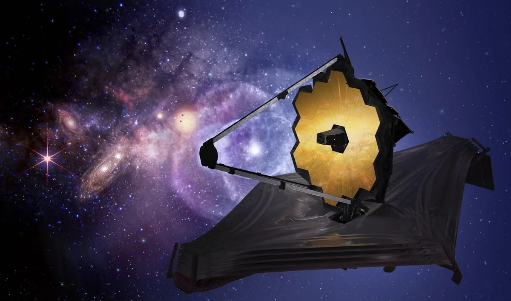
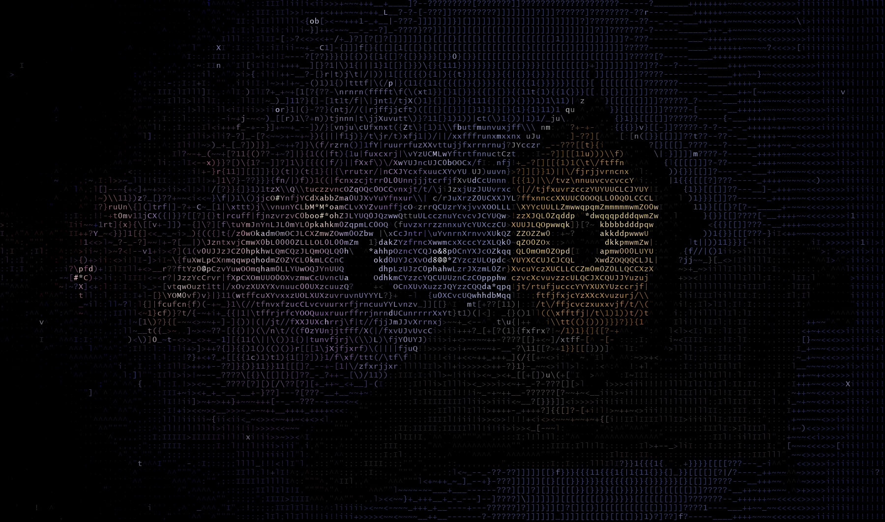
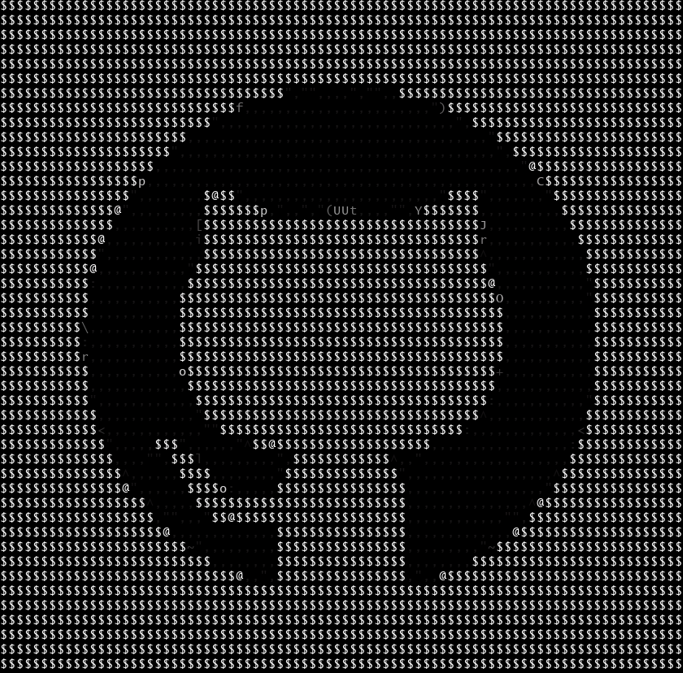

# Image to ASCII
---

### The Basics:
This will break up an input image into many smaller sections the amount depends on the scale factor you use. Then the R, G, and B values for each of these will be read and averaged, think of these sections almost like pixels except because they are substantially larger you will have several pixels in one subsection. based on the average which should be between 0-255 an ascii character with a similar luminosity will be chosen. For example $ is almost white and . is almost black with only a blank space being darker. each character represents one subsection and they are all added to a text document, an image will also be made by adding the characters with the respective color to a black background.

---
### Setup:
I reccomend commenting out the everything in main except get_stocks() and Stock.print_all_instances() and running it once to see what the output looks like and then you can see what you want to do with the data, ajust any of the parameters you need to get your expected output then you can run it for real. If you make changes to the code make sure to delete the stock_info file or modify to match the changes. If you dont do this you can run into unexpected errors. for example changing the risk will cause their to be two of the same trade just under different prices in the document and thus the code will trade it twice. You dont need to worry about adding the stock_info file that will be created on its own by the program. The only file you need to create is the .env. you will put username = 'username' for your robin hood account and on the next line password = 'password' for your robinhood account.

---
### Currently Working On:
There seams to be issues with using .png as opposed to .jpg. I am working on fixing that. Other features to be added is the option for video and choosing what combination of outputs you want print in terminal, create and image, or create a text document. I also want to allow the user to choose weather or not they want to output in color. I will also be creating a tutorial or finding one on how to have your terminal output your ASCII image on startup.

---
### Results:
#### James Webb Space Telecope:
The Input:   

The Output:

#### GitHub Logo:
The Input:

The Output:

